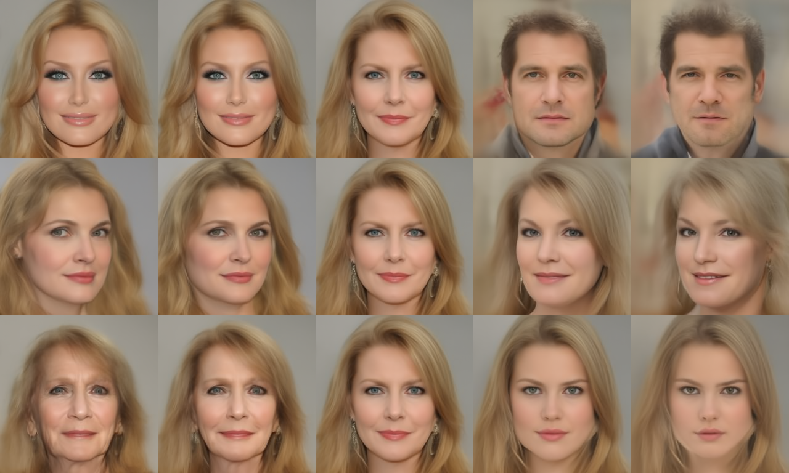
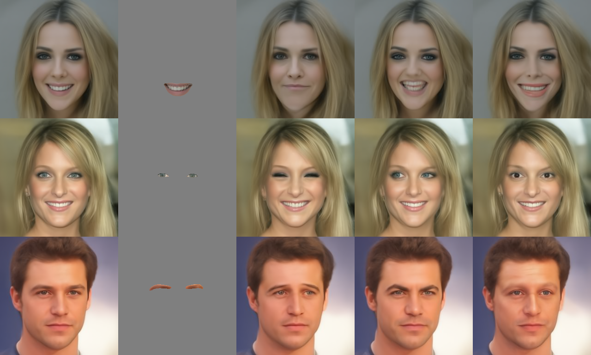
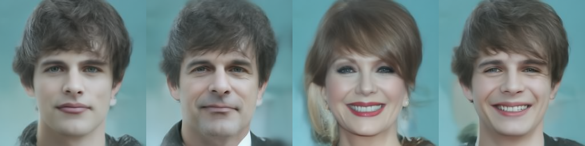

# semantic-diffusion
[](https://www.python.org/downloads/release/python-38/)
[](https://pytorch.org/)


<!-- [Project page](http://itu.dk/~renha/semantic-ddm-official-beta/docs/) | -->
[Paper](https://brosdocs.net/fg2024/267.pdf) |
[Demo](demo.ipynb) 

<!-- [Poster](docs/resources/poster.pdf) | -->
## Discovering Interpretable Directions in the Semantic Latent Space of Diffusion Models
#### René Haas, Inbar Huberman-Spiegelglas, Rotem Mulayoff, Stella Graßhof and Sami S. Brandt and, Tomer Michaeli
*The 18th IEEE International Conference on Automatic Face and Gesture Recognition 27-31 May 2024 SDKM, ITU Campus, Istanbul, Turkey*


**Abstract**
 
> Denoising Diffusion Models (DDMs) have emerged as a strong competitor to Generative Adversarial Networks (GANs). However, despite their widespread use in image synthesis and editing applications, their latent space is still not as well understood. Recently, a semantic latent space for DDMs, coined `h-space', was shown to facilitate semantic image editing in a way reminiscent of GANs. The h-space is comprised of the bottleneck activations in the DDM's denoiser across all timesteps of the diffusion process. In this paper, we explore the properties of h-space and propose several novel methods for finding meaningful semantic directions within it. We start by studying unsupervised methods for revealing interpretable semantic directions in pretrained DDMs. Specifically, we show that global latent directions emerge as the principal components in the latent space. Additionally, we provide a novel method for discovering image-specific semantic directions by spectral analysis of the Jacobian of the denoiser w.r.t. the latent code. Next, we extend the analysis by finding directions in a supervised fashion in unconditional DDMs. We demonstrate how such directions can be found by relying on either a labeled data set of real images or by annotating generated samples with a domain-specific attribute classifier. We further show how to semantically disentangle the found direction by simple linear projection. Our approaches are applicable without requiring any architectural modifications, text-based guidance, CLIP-based optimization, or model fine-tuning.


# Setup

```
conda env create -f environment/research.yml
```

# Usage

### PCA

```python
from semanticdiffusion import load_model, Q
from editing.pca import PCAMethod
from editing.direction_plotter import DirectionPlotter
from utils import image_grid
import torch
 
torch.manual_seed(42)

sd = load_model("pixel", device = "cuda",
                h_space = "after",
                num_inference_steps = 10)

pca = PCAMethod(sd)
dp = DirectionPlotter(sd)
hhs = pca.sample(num_samples=500, etas = 1, force_rerun=False)
PCs, ss, Uts = pca.get_PCs_indv(hhs)

q = sd.sample(seed = 84, etas = 1)
q_edits = []
for eig_idx in [0,1,3]:
    n = dp.get_direction(Uts, ss, svec_idx = eig_idx)
    q_edits += [sd.apply_direction(q.copy(),n, scale = scale) for scale in torch.linspace(-5,5,5)]
imgs = [q.x0 for q in q_edits]
grid = image_grid(imgs, cols = 5, rows = 3)
grid.save("docs/resources/pca.png")
```



### Jacobian
Our Jacobian method (Algorith 1)  supports discovery of semantic directions given a mask. 
In this example we illustrate calculating semantic directions based on binary masks calculated with the [BiSeNet](https://arxiv.org/abs/1808.00897) checkpoint from [zllrunning/face-parsing.PyTorch](https://github.com/zllrunning/face-parsing.PyTorch).
We illustrate semantic editing of the eye, eyebrow and mouth region using our method. For a full list of segmentation regions refer to `SegmentationNetwork` in `models/segmentation.py`.


```python
import torch
import itertools

from semanticdiffusion import load_model, Q
from editing.direction_plotter import DirectionPlotter
from editing.jacobian import PowerItterationMethod
from models.segmentation import SegmentationNetwork
from utils import image_grid, tensor_to_pil


def edit(q, mask, svecs, svals, svec_idx, t_idx, scale):


    n = dp.get_direction(svecs, svals, 
                         svec_idx = svec_idx, t_idx = t_idx, 
                         global_at_idx = True)
    
    q_edit = sd.apply_direction(q.copy(), n, scale = scale)
    img = q_edit.x0
    return img

torch.manual_seed(42)

sd = load_model("pixel", device = "cuda",
                h_space = "after",
                num_inference_steps = 10)

power_iter = PowerItterationMethod(sd)
dp = DirectionPlotter(sd)

seg = SegmentationNetwork()


# Edit eyes
q = sd.sample(seed = 596342, etas = 1)
mask = (seg.get_mask(q, "l_eye") + seg.get_mask(q, "r_eye")).clamp(0,1).detach()
svals, svecs = power_iter.load_power_dirs(q, mask = mask)

edits = [(0,2,-50), (0,8,50), (1,4,-50)]
imgs = [q.x0, q.x0*mask] + [edit(q, mask, svecs, svals, *e) for e in edits]
img_eyes = image_grid(imgs)


# Edit eyebrows
q = sd.sample(seed = 731100, etas = 1)
mask = (seg.get_mask(q, "r_brow") + seg.get_mask(q, "l_brow")).clamp(0,1).detach()
svals, svecs = power_iter.load_power_dirs(q, mask = mask)

edits = [(0,6,75), (1,6,75), (0,2,60)]
imgs = [q.x0, q.x0*mask] + [edit(q, mask, svecs, svals, *e) for e in edits]
img_brows = image_grid(imgs)

# Edit Mouth
q = sd.sample(seed = 406599, etas = 1)
mask = seg.get_mask(q, "mouth").detach()
svals, svecs = power_iter.load_power_dirs(q, mask = mask)

edits = [(0,4,50), (0,4,-50), (1,8,-100)]
imgs = [q.x0, q.x0*mask] + [edit(q, mask, svecs, svals, *e) for e in edits]
img_mouth = image_grid(imgs)

grid = image_grid([img_mouth,img_eyes,img_brows], rows = 3, cols = 1)
grid.save("docs/resources/jacobian.png")
```




### Supervised
Using our supervised method, we find a large collection of meaningful semantic directions using a pretrained domain-specific attribute classier for supervision. We show how to semantically disentangle the found direction by simple linear projection.

```python
from semanticdiffusion import load_model, Q
from editing.anycost import AnycostDirections
from utils import image_grid

sd = load_model("pixel", # Model to load, supports "pixel"/"ldm" or checkpoint path to HuggingFace models
                device = "cuda",
                h_space = "after", # Is the sementic latent space defined as ["before", middle","after"] the middle convolution in the U-net
                num_inference_steps = 10,
                )

ad = AnycostDirections(sd, etas = None,    # Noise schedule. None/0 for DDIM, 1 for DDPM. List if eta_t values is also supported
                       idx_size = 100,     # Size of index. The number of images sampled in total
                        num_examples = 10, # Choose num_examples top(bottom), positive(negative) examples for a given attribute from the sampled images   
                        )

q_original = sd.sample(seed = 76) # All information about a sample is contained in the Q object
img_original = sd.show(q_original) # Easy decoding and conversion to PIL.Image

# Edit Age
label = "Young" #Eg. "Smiling", "Eyeglasses", "Young", "Male" (see full list in editing/anycost.py)
n = ad.get_direction(label)
q_edit = sd.apply_direction(q_original.copy(), n, scale = -0.6)
img_edit_age = sd.show(q_edit)

# Edit smile
label = "Smiling"
clabels = ["Male"]

n = ad.get_direction(label) # Direction for smile
q_edit_smile = sd.apply_direction(q_original.copy(), n, scale = 0.7)
img_edit_smile = sd.show(q_edit_smile)

n = ad.get_cond_dir(label, clabels) # Direction for smile with the direction for gender projected away
q_edit_smile_cond_gender = sd.apply_direction(q_original.copy(), n, scale = 0.7)
img_edit_smile_cond_gender = sd.show(q_edit_smile_cond_gender)

# Plot grid of editing results (in the 100 sampled images, more woman were smiling, we fix this bias with conditional editing)
grid = image_grid([img_original,img_edit_age, img_edit_smile, img_edit_smile_cond_gender])
grid.save("docs/resources/supervised.png")
```




## Citation
If you use this code for your research, please cite our paper:
```
@misc{haas2023discovering,
      title={Discovering Interpretable Directions in the Semantic Latent Space of Diffusion Models}, 
      author={René Haas and Inbar Huberman-Spiegelglas and Rotem Mulayoff and Tomer Michaeli},
      year={2023},
      eprint={2303.11073},
      archivePrefix={arXiv},
      primaryClass={cs.CV}
}
```


